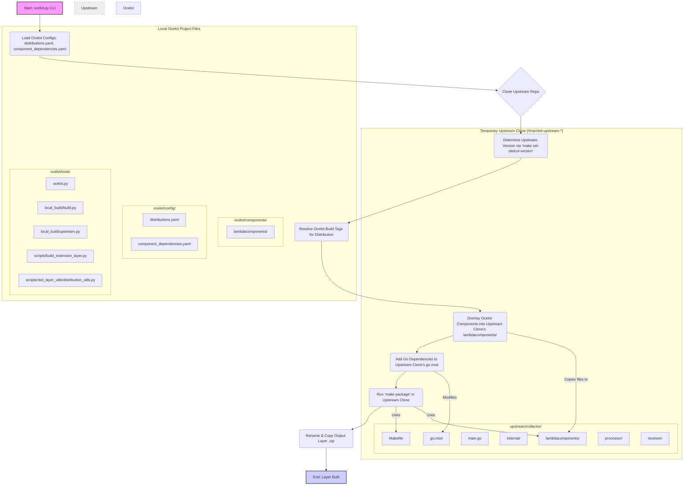
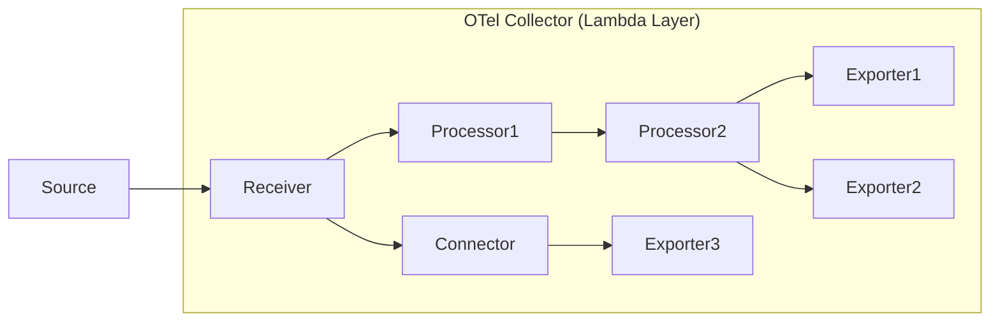

# Ocelot Collector Architecture

This document provides a high-level overview of the Ocelot project architecture, focusing on how custom OpenTelemetry Collector distributions are built for AWS Lambda environments by extending the upstream `open-telemetry/opentelemetry-lambda` collector.

## Table of Contents

- [Overview](#overview)
- [Build Process Flow](#build-process-flow)
- [Upstream Structure (`open-telemetry/opentelemetry-lambda/collector/`)](#upstream-structure-open-telemetryopentelemetry-lambdacollector)
- [Data Flow (Conceptual)](#data-flow-conceptual)

## Overview

Ocelot extends the standard OpenTelemetry Lambda Collector by allowing the inclusion of custom components (connectors, exporters, processors, etc.) from the `opentelemetry-collector-contrib` repository and providing tooling to build different distribution variants tailored to specific needs.

The core idea is to:
1.  Define named **Distributions** (e.g., `minimal`, `clickhouse`, `s3export`) in [`config/distributions.yaml`](./configurations.md#1-configdistributionsyaml). (See [Configurations](./configurations.md))
2.  Each distribution specifies a set of Go **Build Tags** (e.g., `lambdacomponents.exporter.clickhouse`).
3.  These build tags conditionally compile specific Go wrapper files located in Ocelot's [`components/collector/lambdacomponents/`](./components.md). (See [Components](./components.md))
4.  These wrapper files import and register component factories from the `opentelemetry-collector-contrib` repository.
5.  A build process clones the upstream `open-telemetry/opentelemetry-lambda` repository. (See [Upstream Integration](./upstream.md))
6.  The build process **overlays** the selected Ocelot component wrapper files into the corresponding `lambdacomponents/` subdirectory within the *cloned upstream repository*.
7.  It modifies the `go.mod` file in the *cloned upstream repository* to add dependencies required by the overlaid components.
8.  Finally, it compiles the final collector binary using the *upstream's* `Makefile` (`make package`), incorporating both the standard upstream components and the selected Ocelot components.

## Build Process Flow

The local build process is orchestrated by the [`tools/ocelot.py`](./tooling.md#1-toolsocelotpy) script and involves several steps executed by modules within `tools/local_build/` and `tools/scripts/`. (See [Tooling](./tooling.md))

**Key Stages:**

1.  **Configuration Loading (`local_build/config.py`, `otel_layer_utils/distribution_utils.py`):** Reads Ocelot's [`distributions.yaml`](./configurations.md#1-configdistributionsyaml) to determine the build tags for the selected distribution, handling inheritance. Reads Ocelot's [`component_dependencies.yaml`](./configurations.md#2-configcomponent_dependenciesyaml) to map build tags to required Go modules. (See [Configurations](./configurations.md))
2.  **Upstream Handling (`local_build/upstream.py`):** Clones the specified `upstream-repo` (default: `open-telemetry/opentelemetry-lambda`) at the specified `upstream-ref` into a temporary directory. Determines the exact upstream version by running `make set-otelcol-version` within the cloned `collector` subdirectory and reading the generated `VERSION` file. (See [Upstream Integration](./upstream.md))
3.  **Component Overlay (`scripts/build_extension_layer.py`):** Selectively copies Go wrapper files from Ocelot's [`components/collector/lambdacomponents/`](./components.md) directory into the corresponding `collector/lambdacomponents/<type>/` structure within the *temporary upstream clone*. Only components matching the resolved build tags are copied. (See [Components](./components.md))
4.  **Dependency Management (`scripts/build_extension_layer.py`):** Modifies the `go.mod` file within the *temporary upstream clone* using `go mod edit -require=<module>@<version>` to add dependencies listed in [`component_dependencies.yaml`](./configurations.md#2-configcomponent_dependenciesyaml) for the included Ocelot components. Pins dependencies to the determined `upstream_version`. Runs `go mod tidy`.
5.  **Compilation & Packaging (`scripts/build_extension_layer.py`):** Executes `make package` within the `collector` subdirectory of the *temporary upstream clone*. Environment variables (`GOARCH`, `BUILDTAGS`) are set to control the Go build process, ensuring the correct architecture and conditional compilation based on the resolved tags. This uses the upstream `Makefile` and source code, incorporating the overlaid Ocelot component wrappers and dependencies, to produce the final Lambda layer zip file.
6.  **Output Handling (`scripts/build_extension_layer.py`):** Renames the generated zip file (e.g., `opentelemetry-collector-layer-amd64.zip`) to include the distribution name (e.g., `collector-amd64-clickhouse.zip`) and copies it to the designated output directory.
7.  **Cleanup (`local_build/upstream.py`):** Removes the temporary directory containing the upstream clone unless explicitly requested otherwise.

## Upstream Structure (`open-telemetry/opentelemetry-lambda/collector/`)

The upstream collector directory contains:
-   `Makefile`, `Makefile.Common`: Build system files.
-   `go.mod`, `go.sum`: Go module definition.
-   `main.go`: Collector entry point.
-   `internal/`: Internal packages for Lambda API clients, lifecycle management, config converters.
-   `lambdacomponents/`: Directory containing Go files that register standard upstream components (connectors, exporters, etc.) via `default.go` and potentially others via `custom.go`. **This is where Ocelot overlays its component wrappers.** (See [Upstream Integration](./upstream.md) and [Components](./components.md))
-   `processor/`, `receiver/`: Directories containing the actual Go implementations for core upstream components like `coldstartprocessor`, `decoupleprocessor`, `telemetryapireceiver`.

## Data Flow (Conceptual)

The data flow within the running collector depends on the configured components.

-   **Receivers:** Accept telemetry data (e.g., OTLP, Telemetry API).
-   **Processors:** Modify or filter data (e.g., Batch, Decouple, Cold Start).
-   **Connectors:** Bridge pipelines or transform signals (e.g., Signal-to-Metrics).
-   **Exporters:** Send data to backends (e.g., OTLP/HTTP, AWS S3, ClickHouse).

The specific components included are determined by:
1.  The components compiled into the distribution via the build tags (both upstream defaults and Ocelot additions).
2.  The collector's configuration file (deployed alongside the Lambda layer).
